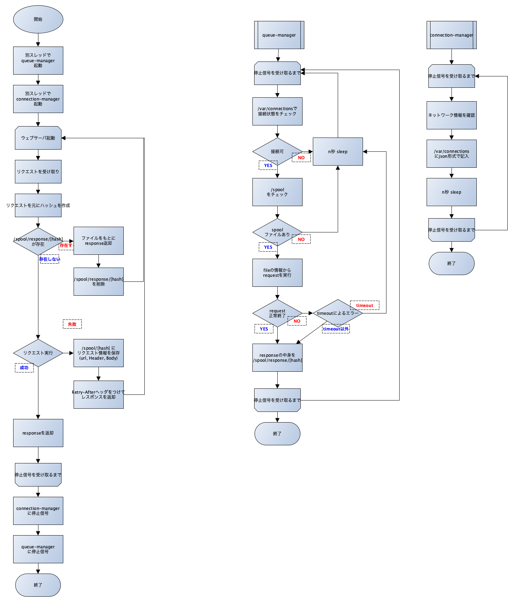

# proxy-queue

## USAGE

```shell
$ curl -v -x "http://localhost:1234" http://httpbin.org/get
*   Trying ::1...
* TCP_NODELAY set
* Connected to localhost (::1) port 1234 (#0)
> GET http://httpbin.org/get HTTP/1.1
> Host: httpbin.org
> User-Agent: curl/7.64.1
> Accept: */*
> Proxy-Connection: Keep-Alive
>
< HTTP/1.1 307 Temporary Redirect
< Content-Length: 32
< Content-Type: text/plain
<
* Connection #0 to host localhost left intact
{"msg":"please wait for access"}* Closing connection 0

$ curl -v -x "http://localhost:1234" http://httpbin.org/get

*   Trying ::1...
* TCP_NODELAY set
* Connected to localhost (::1) port 1234 (#0)
> GET http://httpbin.org/get HTTP/1.1
> Host: httpbin.org
> User-Agent: curl/7.64.1
> Accept: */*
> Proxy-Connection: Keep-Alive
>
< HTTP/1.1 200 OK
< Access-Control-Allow-Credentials: true
< Access-Control-Allow-Origin: *
< Connection: close
< Content-Length: 285
< Content-Length: 285
< Content-Type: application/json
< Date: Wed, 10 Jun 2020 12:02:35 GMT
< Server: gunicorn/19.9.0
<
{
  "args": {},
  "headers": {
    "Accept": "*/*",
    "Content-Length": "0",
    "Host": "httpbin.org",
    "User-Agent": "cpp-httplib/0.6",
    "X-Amzn-Trace-Id": "Root=1-5ee0cbdb-6ad79d39471dce37efe74d11"
  },
  "origin": "27.95.98.134",
  "url": "http://httpbin.org/get"
}

```

## TODO
- [ ] add unittests
- [ ] create Dockerfile

## OVERVIEW

